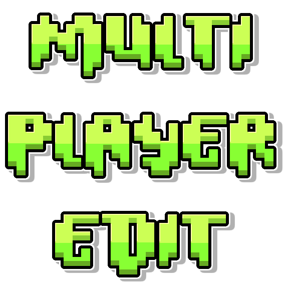

# Multiplayer Edit



Real-time collaborative level editing for Geometry Dash! Host a session, invite your friends with a room code, and build levels together in real-time.

## Features

- **Real-Time Collaborative Editing** — Host a session, share the 6-character room code, and build together.
- **Instant Synchronization** — Placement, deletion, rotation, scaling, and movement are updated instantly across all connected clients.
- **Isolated Undo/Redo Stacks** — Action history is tracked per player, meaning your undo/redo actions won't overwrite or disrupt your collaborators' builds.
- **Player Cursors & Equipped Object Badges** — Track player movements live in the editor. Badges display next to player cursors showing the specific object they currently have selected.
- **Playtesting Avatar Sync** — Watch collaborators playtest in the editor. Their standard mouse cursor transforms into their actual in-game avatar, syncing frames (cube, ship, ball, etc.), colors, custom glow outline, gravity flips, and orientation in real-time.
- **Smart Object Locking** — Automatically locks selected objects to prevent multiple players from editing the same items simultaneously, ensuring no race conditions or crashes.
- **Session HUD & Player List** — Keep track of room details with a built-in player list and status overlay showing the active session code.
- **Join/Leave Notifications** — In-game notifications alert you when collaborators enter or leave the room.

## How to Use

1. Open any level in the Geometry Dash level editor.
2. Click the **Multiplayer** button in the editor pause menu.
3. Click **Host** to create a session and copy the room code, or click **Join** and enter your friend's room code.
4. Once connected, your changes will sync automatically!

## Build Instructions

To build the mod from source, you will need the [Geode SDK and CLI](https://docs.geode-sdk.org/) installed.

```sh
# Clone the repository
git clone https://github.com/xXoanon/MultiplayerEdit.git
cd MultiplayerEdit

# Build the mod for the default platform
geode build
```

To build targeting specific platforms (e.g. Android or Windows cross-compilation on Linux):
```sh
# Windows (on Linux)
geode build --platform win

# Android (64-bit)
geode build --platform android64
```

## Running the Relay Server

The mod routes editor actions through a lightweight WebSocket relay server. A public default server is configured by default (`wss://multiplayeredit.onrender.com`), but you can host your own.

See the [server/README.md](server/README.md) file for setup and hosting instructions. You can update the **Server URL** setting in the mod settings in-game to connect to your custom server.